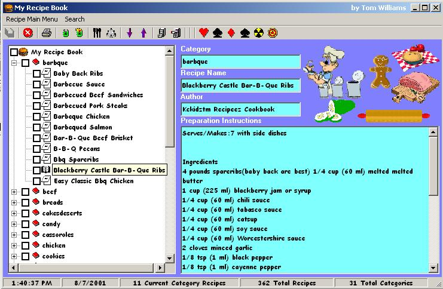



## Recipes Database \(Updated\)

### Description

This code is used to store, track, research and share recipes. I got the application about 8 months ago from PSC from a posting by Bob Davis from Tallahassee Florida. I loved the concept and some of the recipes were cool too.

  

I really liked what Bob did but since I'm a database programmer I had some challenges that I was interested in tackling with regards to his initial design (plus I was board) so this is the result with a few added plus's that my wife dreamt up.

  

There is one thing that is bothering me about this application though and maybe you fellow coders can help me out. For some reason I cannot distribute this to any family members or friends without installing VB6 on their computers. They are using 95B and 98? I have traced it down to the Data Access pieces for the errors (particularly the compact and repair commands). I have installed the MDAC on their PC's and it does not work until I install my copy of VB (Pssst, Please Don't Tell Bill).

  

If you have any advice or critisisem, go ahead and let me know because there is always a better way, a different perspective or something that everyone did not think of.

  

Pardon some of the not so neat code. ;-)

  

Best Regards,

  

Tom Williams
 
### More Info
 
This application uses the latest Microsoft Data Access pack so you will have to intall this to use it correctly (or at least I think).

Always use a code scanner.... I do have a kill and a copy command in my code for the backup/restore process. There is also a custom control that I created with source code. You may need to compile and install or use the one in the zip file if PSC let's it through.

             |
---                |---
**Submitted On**   |2001-08-09 14:21:56
**By**             |[Tom Williams](https://github.com/Planet-Source-Code/PSCIndex/blob/master/ByAuthor/tom-williams.md)
**Level**          |Intermediate
**User Rating**    |4.8 (29 globes from 6 users)
**Compatibility**  |VB 6\.0
**Category**       |[Databases/ Data Access/ DAO/ ADO](https://github.com/Planet-Source-Code/PSCIndex/blob/master/ByCategory/databases-data-access-dao-ado__1-6.md)
**World**          |[Visual Basic](https://github.com/Planet-Source-Code/PSCIndex/blob/master/ByWorld/visual-basic.md)
**Archive File**   |[Recipes Da24348892001\.zip](https://github.com/Planet-Source-Code/tom-williams-recipes-database-updated__1-25947/archive/master.zip)

